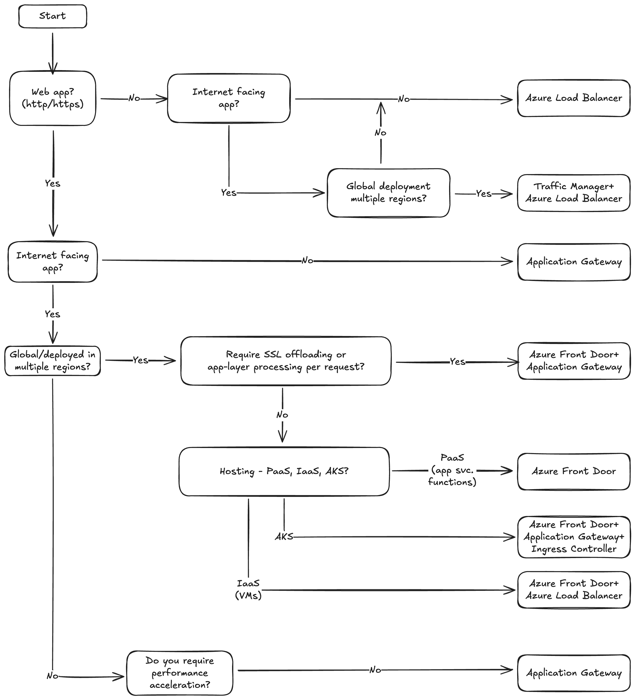

# Azure Network Endpoint Selector



An interactive CLI tool that guides you through selecting the appropriate Azure network endpoint based on your application requirements. Built following Microsoft Azure networking best practices and the Well-Architected Framework.

## Features

- Interactive decision tree for endpoint selection
- Animated Azure-themed terminal interface
- Supports multiple Azure networking services:
  - Azure Load Balancer (Layer 4)
  - Application Gateway (Layer 7)
  - Azure Front Door (Global HTTP/HTTPS)
  - Traffic Manager
  - Combined architectures for complex deployments

## Requirements

- Python 3.10+

## Installation

Clone the repository:

```bash
git clone https://github.com/yourusername/azure-net.git
cd azure-net
```

## Usage

Run the endpoint selector:

```bash
python azure_endpoint_selector.py
```

The tool will ask you a series of questions about your application:

1. Is it a web application (HTTP/HTTPS)?
2. Is it internet-facing?
3. Is it a global multi-region deployment?
4. What is your hosting model (PaaS, AKS, IaaS)?

Based on your answers, it recommends the optimal Azure networking architecture.

## Example

```
 █████╗ ███████╗██╗   ██╗██████╗ ███████╗
██╔══██╗╚══███╔╝██║   ██║██╔══██╗██╔════╝
███████║  ███╔╝ ██║   ██║██████╔╝█████╗
██╔══██║ ███╔╝  ██║   ██║██╔══██╗██╔══╝
██║  ██║███████╗╚██████╔╝██║  ██║███████╗
╚═╝  ╚═╝╚══════╝ ╚═════╝ ╚═╝  ╚═╝╚══════╝
════════════════════════════════════════════

◆ NETWORK ENDPOINT SELECTOR
  Based on Azure Well-Architected Framework

? Is this a web application? (HTTP/HTTPS traffic) [y/n] y
? Is the application internet-facing? [y/n] y
? Is this a global deployment across multiple regions? [y/n] n
? What is your hosting model?
  [1] PaaS  [2] AKS  [3] IaaS
  ▸ 1

╔════════════════════════════════════════════════════════════════╗
║  ✓ RECOMMENDED AZURE NETWORK ENDPOINT
╠════════════════════════════════════════════════════════════════╣
║  Azure Front Door
║  Global HTTP/HTTPS load balancer with CDN and WAF.
║
║  Use Cases:
║    • Global web applications (PaaS)
║    • Performance acceleration via edge locations
║    • Global WAF protection
║    • SSL offloading at the edge
╚════════════════════════════════════════════════════════════════╝
```

## License

MIT
